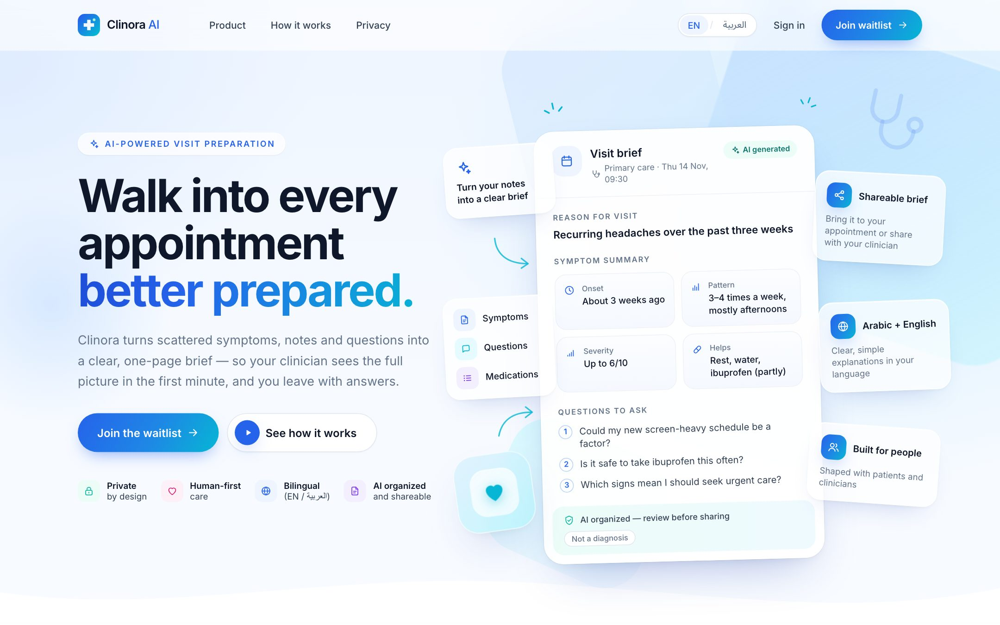
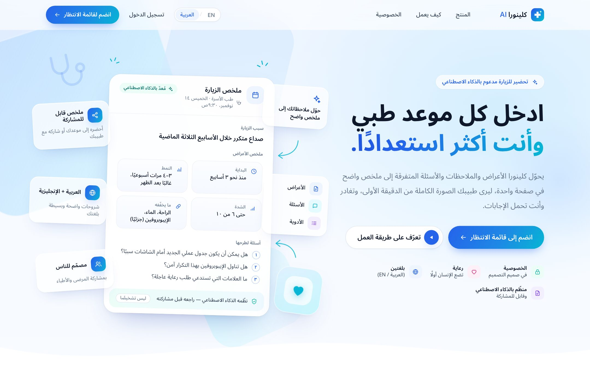
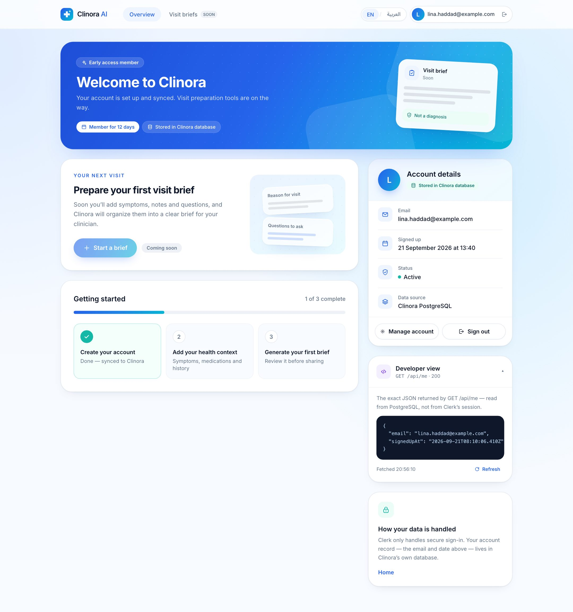
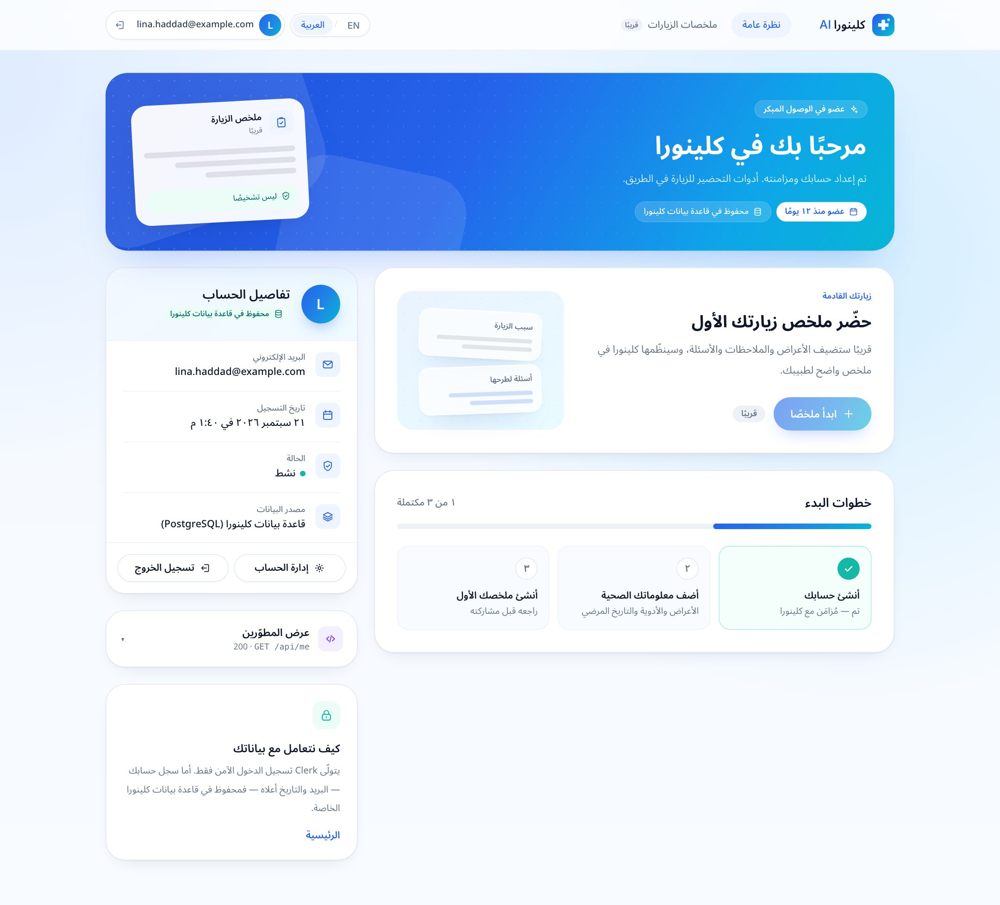
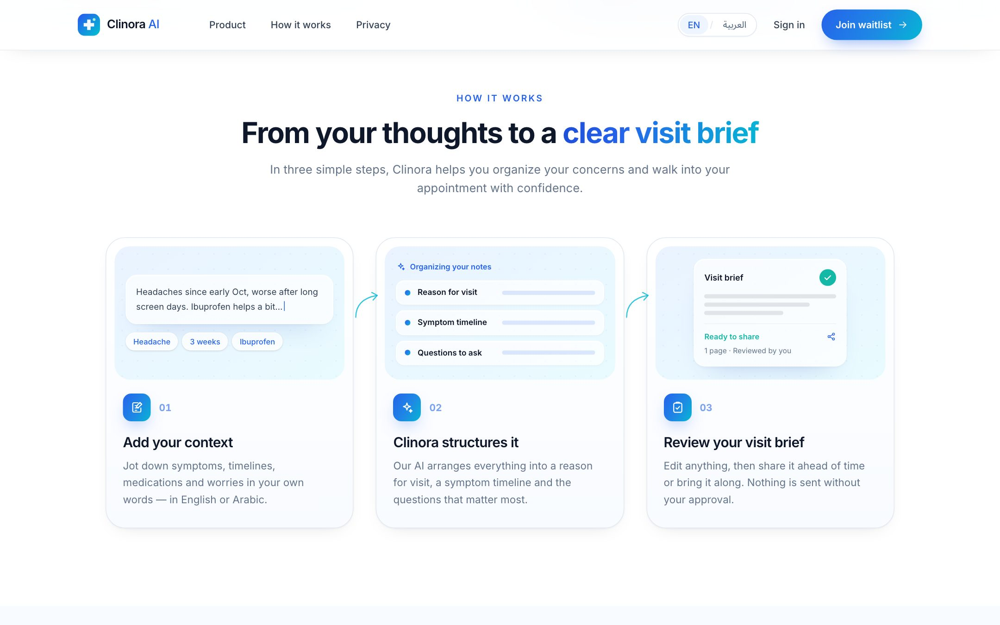
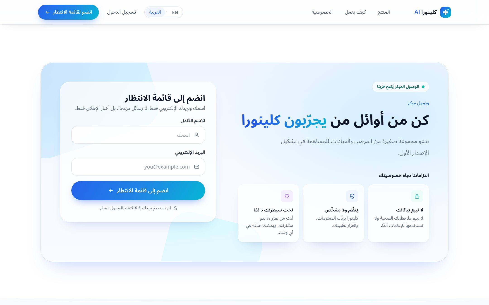
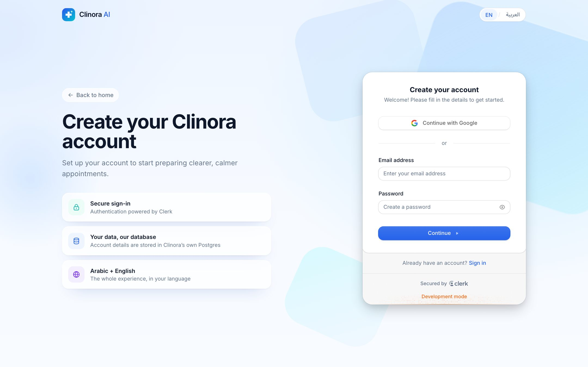
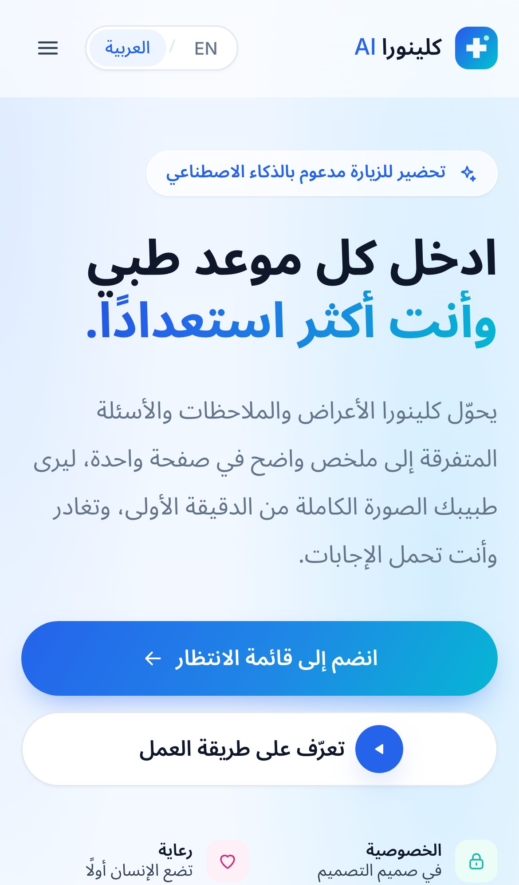

# Clinora AI

**Walk into every appointment better prepared.**

Clinora AI is an original concept for a medical AI product that helps patients prepare for appointments. It turns scattered symptoms, notes and questions into a structured one-page **visit brief**. This repo contains the marketing site, a waitlist backed by Postgres, Clerk authentication, and an authenticated account page that reads from the app's own database. Everything works in English and in fully mirrored Arabic (RTL).

Designed and built by **Vivek Chaudhary** ([@Venerablevivek](https://github.com/Venerablevivek)).

> I built this with a **personal Clerk test project** on Clerk's free tier. To run it, create your own Clerk development instance (steps below). No keys are committed.

**Live demo:** [cliniora-ai.vercel.app](https://cliniora-ai.vercel.app) · **Database:** Neon Postgres · **CI:** lint, typecheck, build, 25 integration tests, 18 E2E tests

| English | Arabic (RTL) |
| --- | --- |
|  |  |
|  |  |

<details>
<summary>More screenshots</summary>

| | |
| --- | --- |
|  |  |
|  |  |

</details>

---

## Stack

| Concern | Choice |
| --- | --- |
| Framework | Next.js 16 (App Router), React 19, TypeScript (`.tsx`) |
| Styling / motion | Tailwind CSS v4, Framer Motion |
| Data | PostgreSQL + Prisma 7 (`@prisma/adapter-pg`) |
| Auth | Clerk (pre-built `<SignIn />` / `<SignUp />`), Clerk middleware |
| Webhooks | Svix signature verification |
| Validation | Zod (one schema shared by the client and the API) |
| Testing | Vitest (integration, real Postgres), Playwright (E2E, desktop + mobile) |
| Hosting | Vercel + Neon Postgres |

## Quick start

**Prerequisites:** Node 20.9+ (CI uses 24), a PostgreSQL database (local, Neon, or Supabase), and a free Clerk account.

```bash
npm install                 # also runs `prisma generate`
cp .env.example .env        # then fill in the values (see below)
npm run db:migrate          # create the tables
npm run dev                 # http://localhost:3000
```

Other scripts:

```bash
npm run build && npm start  # production build
npm run lint                # ESLint
npm run typecheck           # tsc --noEmit
npm run db:studio           # browse data in Prisma Studio
npm run db:deploy           # apply migrations in CI/production (no prompts)
npm run webhook:simulate    # send a signed test webhook to the local app (see below)
npm test                    # integration tests (needs TEST_DATABASE_URL, see Testing)
npm run test:e2e            # Playwright E2E (starts its own server on :3100)
npm run screenshots         # regenerate docs/screenshots from a running app
```

## Environment variables

Next.js and the Prisma CLI both read a single `.env` file:

| Variable | Description |
| --- | --- |
| `DATABASE_URL` | Postgres connection string used by the app. On Neon, use the **pooled** string (host contains `-pooler`). |
| `DIRECT_URL` | *Optional.* Direct (non-pooled) connection used by `prisma migrate`. On Neon, the same string without `-pooler`. |
| `TEST_DATABASE_URL` | *Tests only.* A separate, disposable database. Integration tests truncate its tables. |
| `NEXT_PUBLIC_APP_URL` | *Optional.* Public URL for Open Graph links. On Vercel the production URL is used automatically. |
| `NEXT_PUBLIC_CLERK_PUBLISHABLE_KEY` | Clerk → **API keys** (`pk_test_…`) |
| `CLERK_SECRET_KEY` | Clerk → **API keys** (`sk_test_…`) |
| `CLERK_WEBHOOK_SECRET` | Clerk → **Webhooks** → your endpoint → **Signing secret** (`whsec_…`) |
| `NEXT_PUBLIC_CLERK_SIGN_IN_URL` | `/sign-in` |
| `NEXT_PUBLIC_CLERK_SIGN_UP_URL` | `/sign-up` |
| `NEXT_PUBLIC_CLERK_SIGN_IN_FALLBACK_REDIRECT_URL` | `/dashboard` |
| `NEXT_PUBLIC_CLERK_SIGN_UP_FALLBACK_REDIRECT_URL` | `/dashboard` |

## PostgreSQL & migrations

The schema is in `prisma/schema.prisma`, and the initial migration is committed in `prisma/migrations/`.

```bash
createdb clinora            # or create a database in Neon / Supabase
npm run db:migrate          # dev: applies migrations and prompts for new ones
npm run db:deploy           # CI / production: applies committed migrations only
```

Prisma 7 notes: the connection URL lives in `prisma.config.ts` rather than the schema. The CLI uses `DIRECT_URL` when it's set and falls back to `DATABASE_URL`, while the app always uses `DATABASE_URL`. The client is generated to `lib/generated/prisma` (git-ignored, regenerated on `npm install`) and connects through the `pg` driver adapter.

## Clerk test-project setup

1. Go to [dashboard.clerk.com](https://dashboard.clerk.com) and **create an application**. A development instance is fine. Enable **Email** (and optionally Google).
2. Open **API keys** and copy the publishable key and the secret key into `.env`.
3. Nothing else is required. The sign-in and sign-up pages live at `/sign-in` and `/sign-up` as catch-all routes that render Clerk's pre-built components.

## Clerk webhook setup

The webhook is the primary way users get into Postgres.

1. Expose your local server publicly, for example:
   ```bash
   ngrok http 3000
   ```
2. In Clerk → **Webhooks** → **Add endpoint**:
   - URL: `https://<your-tunnel>/api/webhooks/clerk`
   - Events: `user.created`, `user.updated`, `user.deleted`
3. Copy the endpoint's **Signing secret** into `CLERK_WEBHOOK_SECRET` and restart `npm run dev`.
4. Sign up in the app. Clerk's webhook log should show a `200`, and the user appears in `npm run db:studio`.

**No tunnel?** You can test the sync logic locally with a correctly signed payload:

```bash
npm run webhook:simulate -- user.created user_test_1 jane@example.com
npm run webhook:simulate -- user.updated user_test_1 jane.new@example.com
npm run webhook:simulate -- user.deleted user_test_1
```

Without a tunnel the app still works end to end, because `/api/me` has a fallback (explained below).

## Deploying (Vercel + Neon)

1. **Neon:** create a project and copy both connection strings, **pooled** and **direct**. Apply the schema once from your machine:
   ```bash
   DATABASE_URL="<pooled>" DIRECT_URL="<direct>" npm run db:deploy
   ```
2. **Vercel:** import the repo. The framework preset is detected automatically, and `npm install` runs `prisma generate`. Add the environment variables from the table above (`DATABASE_URL` = pooled, plus the Clerk keys and URLs).
3. **Clerk webhook:** add the endpoint `https://<your-app>.vercel.app/api/webhooks/clerk` with the `user.created`, `user.updated` and `user.deleted` events. Copy its signing secret into Vercel as `CLERK_WEBHOOK_SECRET` and redeploy.
4. **Verify:** sign up on the live site. Clerk's webhook log should show `200`. On `/dashboard`, open **Developer view** to see the raw `/api/me` JSON, then change your email under **Manage account**: the `user.updated` webhook updates Postgres, and the dashboard refreshes on its own.

> When you add a migration later, run `npm run db:deploy` against Neon before (or as part of) deploying.

## Testing

```bash
createdb clinora_test
export TEST_DATABASE_URL="postgresql://<you>@localhost:5432/clinora_test?schema=public"
npm test              # 25 integration tests: Vitest against a real Postgres
npm run test:e2e      # 18 E2E tests: Playwright, desktop + mobile (needs Clerk keys in .env)
```

- **Integration tests (`tests/integration`)** call the real route handlers against a real database. They don't mock Prisma, so unique constraints and transactions are actually exercised.
  - `users.test.ts`: idempotent upsert, `signedUpAt` never overwritten, email updates, stale-email release, 5 concurrent upserts producing 1 row, and delete.
  - `clerk-webhook.test.ts`: payloads signed with real Svix signatures. Covers bad and missing signatures (400), create, redelivery, update, delete, users without an email, and unrelated event types.
  - `me-api.test.ts`: Clerk is mocked. Covers 401 without a session, Postgres winning over Clerk's data, `no-store` caching, the Backend-API fallback sync, and `404 USER_NOT_SYNCED`.
  - `waitlist-api.test.ts`: 201, case-insensitive duplicate (409), per-field error codes (422), and malformed JSON (400).
- **E2E tests (`tests/e2e`)** cover the hero and sections rendering, the waitlist success and duplicate flow, inline validation, switching to RTL Arabic and keeping it after a reload, Arabic validation messages, no horizontal overflow in either language, the `/dashboard` → `/sign-up` redirect, `/api/me` returning 401, and the branded 404. Playwright starts its own server on port 3100 pointed at `TEST_DATABASE_URL`, so it never writes into your real data.
- **CI (`.github/workflows/ci.yml`)** runs lint, typecheck and build; integration tests against a Postgres 17 service; and a `prisma migrate diff` drift check. E2E runs when you add Clerk keys as repository secrets and set the repository variable `RUN_E2E=true`.

---

## Architecture

```
app/
  page.tsx                         Landing page (hero, how it works, product, waitlist)
  not-found.tsx, error.tsx         Branded 404 / error pages (bilingual)
  opengraph-image.tsx              Generated social preview image
  sign-in/[[...sign-in]]/page.tsx  Clerk <SignIn /> in a branded shell
  sign-up/[[...sign-up]]/page.tsx  Clerk <SignUp /> in a branded shell
  dashboard/                       Protected account page (layout re-checks auth)
  api/waitlist/route.ts            POST: Zod validation → insert, unique email
  api/me/route.ts                  GET: Clerk auth → clerkUserId → Postgres row
  api/webhooks/clerk/route.ts      POST: Svix-verified Clerk → Postgres sync
proxy.ts                           Clerk middleware (Next 16's name for middleware.ts)
lib/
  users.ts                         Idempotent user upsert shared by webhook + /api/me
  validators.ts                    Shared Zod schema + typed API contract
  i18n/                            Locale config, EN/AR dictionary, server cookie reader
components/
  language-provider.tsx            Locale context; updates <html lang dir>
  landing/, auth/, dashboard/      Feature components
tests/
  integration/                     Vitest: route handlers + sync logic on real Postgres
  e2e/                             Playwright: user flows, RTL, routing
```

### Getting Clerk users into Postgres (the part I spent the most time on)

```
Clerk sign-up ──► Svix-signed webhook ──► /api/webhooks/clerk ──► upsertUserFromClerk() ──► Postgres
                                                                         ▲
Dashboard ──► GET /api/me ──► auth() → clerkUserId ──► SELECT by clerkUserId
                                   └─ row missing? fetch the user from Clerk's Backend API ─┘
```

- **The webhook is the primary path.** `user.created` and `user.updated` upsert `{ clerkUserId, primary email, signedUpAt }`, and `user.deleted` removes the row. The handler verifies the Svix signature against the **raw** request body before it parses anything. It returns `2xx` only when retrying wouldn't help, so Svix's retries cover transient database failures.
- **`/api/me` has a fallback.** There is a race: Clerk redirects to `/dashboard` right after sign-up, sometimes before the webhook arrives, and in local dev the webhook may never arrive. If the row is missing, `/api/me` fetches the user **server-to-server** from Clerk's Backend API and writes it through the same upsert. The response is still the Postgres record, and the browser never supplies identity data. The dashboard also retries briefly on `404 USER_NOT_SYNCED`.
- **The upsert is idempotent and safe under races.** It is keyed on `clerkUserId`, so webhook retries, out-of-order delivery, and the fallback can all run concurrently. A losing concurrent insert (`P2002`) retries and takes the update path.
- **`signedUpAt` is immutable.** It is set from Clerk's `created_at` on insert and never overwritten. Updates only change the email.
- **Stale emails are released.** Clerk guarantees each email belongs to one live user. If a local row still holds an email under a different Clerk id (for example, a deleted account whose `user.deleted` event was missed), that row is stale and is removed in the same transaction. Without this, the unique constraint would block the new user.
- **The dashboard never shows Clerk session data.** `/api/me` calls `auth()` only to get `clerkUserId`, and the email and date on screen come from Postgres.
- **You can see the sync working.** The dashboard's **Developer view** shows the exact `/api/me` JSON. **Manage account** opens Clerk's `<UserProfile />`. When Clerk reports a profile change, the dashboard uses that change only as a *trigger* and re-reads Postgres a few times while the `user.updated` webhook lands. It also refetches whenever the tab becomes visible again.
- **Local caveat:** without a webhook endpoint (no tunnel), the fallback covers *creating* the user, but email changes only reach Postgres through `user.updated`. Deploy, or use `npm run webhook:simulate`, to see that path.

### Route protection

- `proxy.ts` runs `clerkMiddleware`. Signed-out requests to `/dashboard` are redirected to **`/sign-up`** (per the brief), with a `redirect_url` back to the dashboard. Returning users can switch to sign-in from the Clerk card.
- `app/dashboard/layout.tsx` re-checks `auth()` on the server (defense in depth, and Clerk's current guidance). `/api/me` returns `401` JSON rather than redirecting.

### Waitlist

- The same Zod schema validates in the browser (instant feedback) and in the route handler (the source of truth). Emails are trimmed and lowercased, so `Jane@Example.com` and `jane@example.com` count as the same address.
- Duplicate emails are caught by the database's unique index (catching `P2002`) rather than a read-then-write, which could race. The API returns a typed contract: `201 joined`, `409 already_joined`, `422 invalid` (with per-field error codes), or `500 error`.
- The API returns error **codes**, not prose, and the client translates them. Validation messages therefore appear in Arabic too.

### English / Arabic

- **Server-rendered direction.** The locale is stored in a cookie, so the root layout renders `<html lang="ar" dir="rtl">` on the first byte, with no flash of LTR. The toggle updates `document.documentElement` immediately and then calls `router.refresh()` to update the page metadata and Clerk's localization (`@clerk/localizations` `arSA`).
- **Small typed dictionary.** `lib/i18n/messages.ts` holds the strings. The Arabic dictionary is typed against the English one, so a missing key is a compile error. All visible copy is translated, including validation errors, the dashboard, the auth shell and Clerk's own UI.
- **Logical layout only.** The layout uses `ps/pe`, `ms/me`, `start/end`, `inset-x` and `text-start`, never hard-coded left or right, so the grid, header, lists and cards mirror naturally. Directional arrows flip with `rtl:-scale-x-100`. Latin letter-spacing and uppercase eyebrows are turned off in Arabic, and line-height is increased for Arabic script.
- **Typography.** Noto Sans Arabic is used for Arabic and Inter for Latin. Any element can opt in to a font through its `lang` attribute; for example, the "العربية" label renders in the Arabic font on the English page.
- **Mixed-direction text.** Emails are wrapped in `<bdi dir="ltr">`, and user-entered names are isolated in `<bdi>` so Latin text can't scramble Arabic punctuation. The email input stays LTR but is right-aligned on Arabic pages. Dates and numbers use the Gregorian calendar with Arabic-Indic digits, to match the copy.

### Design

- **Visual language:** a light theme on a `#F8FBFF` canvas with white surfaces, navy text, a blue primary colour and cyan/mint accents, plus soft violet and pink for icon tints. Translucent "glass" slabs and frosted cards give depth, rounded 16–36px corners keep it soft, and the blue→cyan gradient is reserved for CTAs, headline highlights and key icons. All tokens live in `app/globals.css` (`@theme`, plus `glass`, `bg-hero` and `text-brand-gradient` utilities).
- **Hero:** a layered composition. A realistic **Visit Brief** card sits in the centre, with satellite cards around it: inputs flowing in (notes → symptoms, questions, medications) on one side and outcomes (shareable, bilingual, people-first) on the other. Hand-drawn connector arrows and a curved wave lead into the next section. The whole composition mirrors in Arabic.
- **Sections:** How it works shows a three-step flow with a mini product illustration per step. Product is a bento of four features with small visual previews. The waitlist is a glass panel with privacy commitment cards. The footer has link columns and a language switch.
- **Dashboard:** a gradient welcome banner showing how long you've been a member and where your data is stored, an "account details" card with email, sign-up date, status and data source (the email and date come straight from `/api/me`), **Manage account** (Clerk `<UserProfile />`), a **Developer view** with the raw API response, a teaser for the upcoming brief builder, a getting-started progress card and a privacy note. Every data-driven element has loading, syncing and error states, and a route-level skeleton (`loading.tsx`) appears instantly.
- **Polish:** branded, bilingual 404 and error pages; a skeleton that reserves space for Clerk's widget so the auth pages don't shift; a generated Open Graph image and per-locale metadata; and glass blur turned off on small screens for performance.
- **Motion:** entrance and stagger animations (0.35–0.6s), scroll-reveal on section cards, a gentle float on a few hero satellites, and the waitlist success state. All of it respects `prefers-reduced-motion`.
- **Accessibility:** skip link, labelled inputs with `aria-invalid` and `aria-describedby`, `aria-live` form status, `aria-pressed` on the language toggle, a progressbar role, and visible focus rings. The mobile menu moves focus to its first link, closes on Escape (returning focus to the toggle) or on an outside click. Decorative layers are `aria-hidden`.

## What I would improve with more time

- **Abuse protection on the waitlist:** rate limiting (for example Upstash) plus a honeypot or Turnstile, and a double opt-in confirmation email.
- **Authenticated E2E:** use Clerk's testing tokens (`@clerk/testing`) to cover sign-up → webhook → dashboard in the browser. The current E2E suite stops at the auth boundary; the server side is covered by the integration tests.
- **Webhook robustness:** store processed `svix-id`s for exact-once semantics, and ignore events older than the last applied `updated_at` so an out-of-order `user.updated` can't restore an old email.
- **i18n at scale:** move to locale-prefixed routes (`/ar/...`) for SEO and shareable links, and use `next-intl` or a translation workflow once the copy grows. Arabic copy should get a native-speaker review.
- **Product:** the actual brief builder (structured intake → AI summarization with clear safety rails → editable, shareable brief), plus a Privacy page to replace the inline commitments.
- **Ops:** structured logging and error monitoring (for example Sentry), Neon preview branches per pull request, and a seed script.
